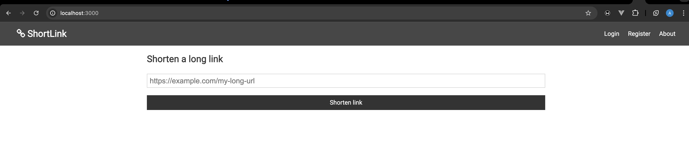
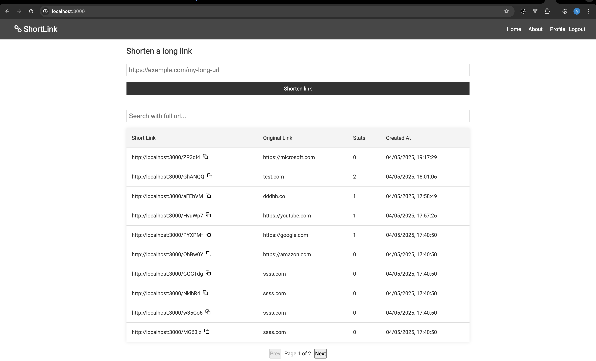
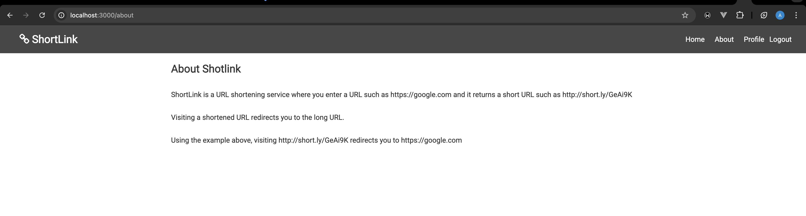

# SHORTLINK

ShortLink is a URL shortening service where you enter a URL such as https://google.com and it returns a short URL such as http://short.ly/GeAi9K

Visiting a shortened URL redirects you to the long URL.

Using the example above, visiting http://short.ly/GeAi9K redirects you to https://google.com

It includes the following:
- [Backend API](./backend/) with Nestjs, TypeORM & MySQL
- Routes for auth, encode and decode urls
- JWT for authentication
- [React frontend](./frontend/) with login, register, create short links, list short links search links and pagination
- Redux for state management
- Vanilla Bootstrap for UI/CSS
- React Toastify for notifications

### Screenshots

....

....



### API Documentation -- [See on Postman](https://documenter.getpostman.com/view/13841071/2sB2j6AWbx)

```
# Running documentation locally
- Goto the Postman link above, and on the top right, Click on "Run in Postman", make sure you have postman running locally
```

## App Structure

```sh
frontend
backend
docker-compose.yml
```

### [Frontend](./frontend/)
```sh
|--- public
|    |--- public files
|--- src
|    |--- assests
|    |--- components
|    |--- pages
|    |--- slices
|    |--- types
|    |--- utils
|    |--- store.ts
|    |--- other app files
|--- package.json
|--- tsconfig.json
|--- other app and environment files
```

### [Backend](./backend/)
```sh
|--- src
|    |--- auth
|    |--- common
|        |--- utils
|    |--- config
|    |--- pagination
|    |--- short-links
|    |--- users
|--- package.json
|--- tsconfig.json
|--- other environment files

# Just like the folder name is defined above, it state what it does and handles in a modular form.
# `auth` - Handles all auth files and logic
# `short-links` - Handles all shortlinks logic
# `users` - Handles all users logic

....

# The api uses TypeORM and MySQL, migrations/entities are automatically loaded when app is started
```

## Development Environment

### Setup

Ensure you have the following softwares installed:

- [Node](https://nodejs.org)
- [Docker](https://docs.docker.com/install/) (if you need to run as container)
- [Git](https://www.atlassian.com/git/tutorials/install-git)

- Clone the [repository](https://github.com/sodiadrhain/shortlink.git) and proceed with the instructions below.


### Running locally

This fontend and backend app is written with Typescript, and Nodejs powers it. You can use `npm` or `yarn` to install packages.

### Env Variables

For the backend side of thing create file `.env` from the `.env.example`. Fill the details for the envs below for datatabase connection:

```
DATABASE_HOST=
DATABASE_PORT=
DATABASE_USERNAME=
DATABASE_PASSWORD=
DATABASE_NAME=
```

i.e run in terminal

```
cp .env .env.example
```

### Install Dependencies (frontend & backend)

```
cd frontend
npm install

cd backend
npm install
```

### Run

```
# Run frontend (:3000) 
npm run dev

# Run backend (:9000)
npm run start:dev
```

## Running as Docker Container

Ensure you have docker and docker compose installed to do this, to check if `docker` and `docker compose` is installed correctly run:

```
docker -v
```

```
docker-compose -v
```

- From within the project directory:

- Run docker compose to start the apps: shortlink_frontend, shortlink_backend, mysql (database), adminer (database manager)

```
docker compose up -d
```

### Viewing the running ports

Open a new terminal window and run the following command:

```
docker ps
```

You will be given a printout showing your running containers. Part of the printout should contain something like this:

```
.....   0.0.0.0:9000-9000/tcp,     shortlink_backend

```

```
.....   0.0.0.0:3000-3000/tcp,     shortlink_frontend

```

```
.....    0.0.0.0:8080->8080/tcp,     database_manager

```

```
.....   0.0.0.0:3306->3306/tcp,     database

```

This tells you that the various machines exist "locally" at 0.0.0.0 and that the exposed web port have been mapped to a port.

### Stopping Containers

To stop the services from running, run:

```
docker compose down
```

### Starting Container

```
docker compose up
```

This will start the app again.

Ensure you update the necessary configurations in the `.env` file, particularly the database configuration and then restart the `shortlink_backend` container.


## Testing APIs with Documentation -- [See on Postman](https://documenter.getpostman.com/view/13841071/2sB2j6AWbx)

```sh
# Running documentation locally
    - Goto the Postman link above, and on the top right, Click on "Run in Postman", make sure you have postman running locally

# Documentation structure
|--- Auth
|--- Shortlink

# `Auth` - This defines all authentication to the api
    # Login
    # Register

# `Shorlink` - Encoding and decoding the links
    # ENCODE, DECODE, LIST and STATS endpoints
```

### Running the API tests local in application

Make sure DB is connected

Change directory to backend (if not there)

```sh
cd backend
```

Run (to install any dependancies and packages)

```sh
npm install
```

then:

```sh
npm run test
```

to see the test results

N/B test file is here: [./backend/src/short-links/short-links.test.spec.ts](/backend/src/short-links/short-links.test.spec.ts)

The test covers for testing the apis
____________________________________________________________________________________________________________________________________________________________________